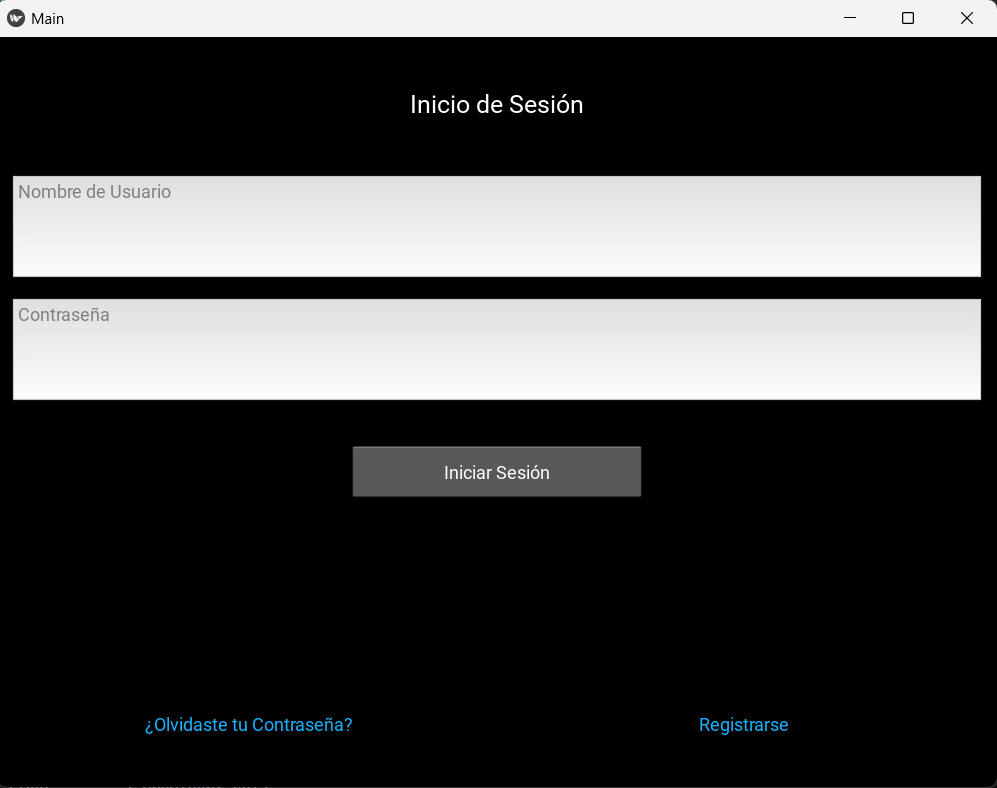
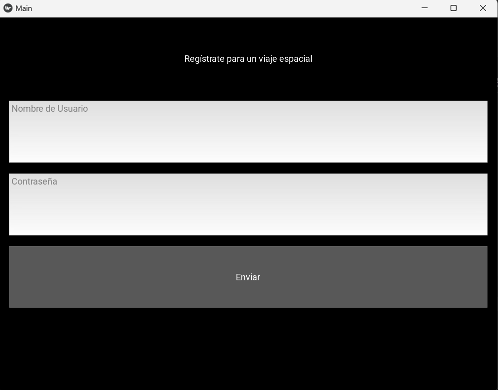
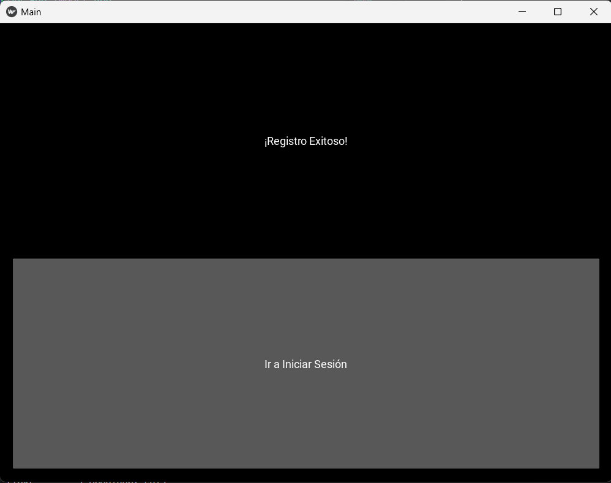
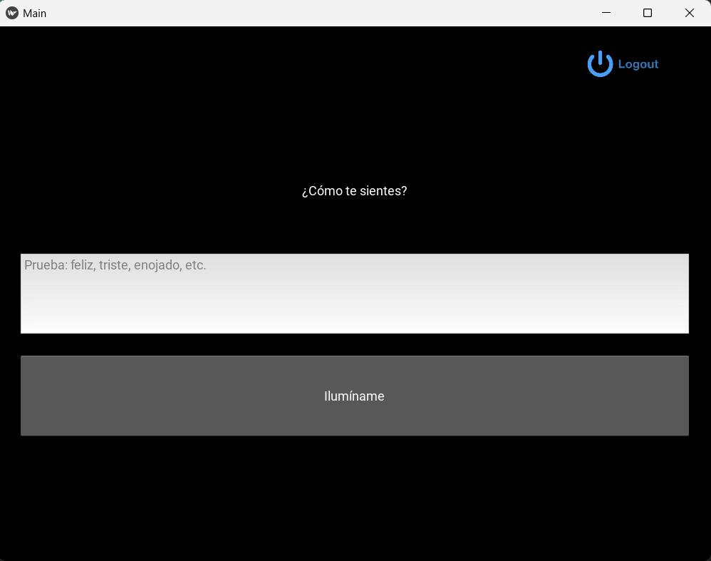
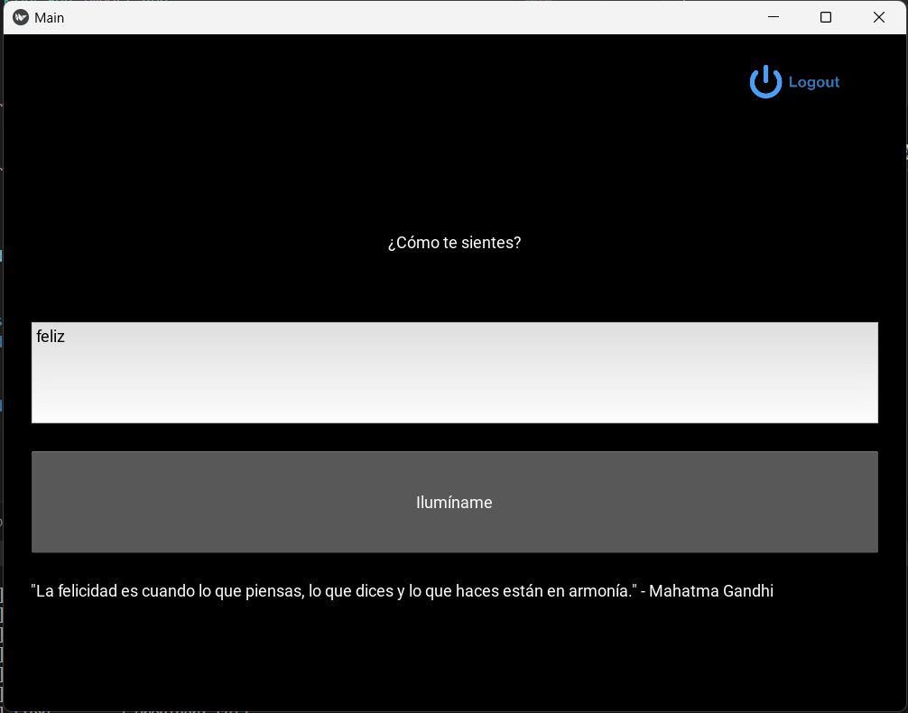

# Feel-Good App 🌟

Una aplicación interactiva que permite a los usuarios iniciar sesión, registrarse y obtener citas inspiradoras basadas en su estado de ánimo.

## Sobre el proyecto 📖
Este proyecto fue desarrollado como parte del curso ***The Python Mega Course: Build 10 Real World Applications*** en Udemy. Su objetivo es practicar el desarrollo de interfaces gráficas con la biblioteca Kivy y otros conceptos de Python, como manejo de archivos, validaciones y efectos visuales.

## Características principales ✨

* **Inicio de Sesión y Registro:**
Permite a los usuarios registrarse y autenticarse en la app.

* **Inspiración basada en emociones:**
Los usuarios pueden ingresar cómo se sienten (feliz, triste, enojado, etc.) y recibir citas motivadoras relacionadas con su emoción.

* **Interfaz interactiva y atractiva:**
    Construida con ```Kivy```, una biblioteca Python para desarrollo de interfaces gráficas, incluyendo elementos como botones con efecto de hover.

## Requisitos del sistema 🛠️

* Python: 3.7 o superior
* Bibliotecas necesarias:

    Instalar las dependencias usando ```pip```:

    ```bash
        pip install kivy
    ```

## Cómo usar 🚀

1. Clona el repositorio.

2. Prepara los datos: Asegúrate de que el archivo users.json existe en el directorio raíz. Si no está, crea uno vacío:
    
    ```json
        {}
    ```
    También, asegúrate de tener archivos de citas en la carpeta ```quotes```/ (por ejemplo, ```feliz.txt```, ```triste.txt```, etc.).

3. Ejecuta la aplicación:

    ```bash
        python main.py
    ```

## Estructura del proyecto 📂

```bash
feel-good-app/
├── main.py                # Código principal de la app
├── design.kv              # Diseño de la interfaz en Kivy
├── hoverable.py           # Comportamiento de hover para botones
├── users.json             # Base de datos de usuarios
├── quotes/                # Carpeta con archivos de citas
│   ├── feliz.txt          # Citas para "feliz"
│   ├── triste.txt         # Citas para "triste"
│   └── desamor.txt        # Citas para "desamor"
```
## Capturas de pantalla 📸

* Pagina de inicio

    

* Pagina de registro:

    

* Pagina de registro exitoso:

    


* Pagina principal:

    

* Pruena con feliz:

    

